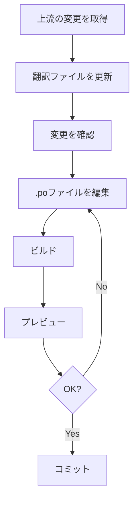

# .po 翻訳ワークフロー

このドキュメントは、.po翻訳システムでの日常的な翻訳作業のワークフローを説明します。

---

## 📋 目次

1. [日常的なワークフロー](#日常的なワークフロー)
2. [シナリオ別ガイド](#シナリオ別ガイド)
3. [ベストプラクティス](#ベストプラクティス)
4. [チーム作業](#チーム作業)

---

## 日常的なワークフロー

### 標準的な翻訳サイクル



### ステップバイステップ

#### 1. 上流の変更を取得

英語版の最新の変更を取り込みます。

```bash
# 上流リポジトリから変更を取得
git fetch upstream

# マージ
git merge upstream/main

# コンフリクトがある場合は解決
# （通常、.poファイルのコンフリクトはmsgcatで解決できます）
```

**頻度:** 週1回、または大きな変更があったとき

---

#### 2. 翻訳ファイルを更新

```bash
cd docs

# 英語RSTから翻訳可能文字列を抽出
make gettext

# 日本語.poファイルを更新
make ja-update
```

**何が起きる？**
- 新しい文字列が追加される
- 変更された文字列に`fuzzy`フラグが付く
- 削除された文字列がコメントアウトされる

---

#### 3. 変更を確認

```bash
# 翻訳統計を表示
make ja-stats

# または、Git差分で変更を確認
cd ..
git diff docs/locale/ja/LC_MESSAGES/
```

**確認すること:**
- どのファイルが変更されたか
- 未翻訳エントリがいくつ追加されたか
- Fuzzyエントリがいくつあるか

---

#### 4. .poファイルを編集

お好みのツールで.poファイルを編集します。

**推奨ツール:**

##### A. Poedit（初心者向け）
```bash
# Poeditでファイルを開く
poedit docs/locale/ja/LC_MESSAGES/index.po
```

##### B. VS Code（開発者向け）
```bash
# VS Codeで開く
code docs/locale/ja/LC_MESSAGES/index.po
```

##### C. テキストエディタ
```bash
# vim, nano等
vim docs/locale/ja/LC_MESSAGES/index.po
```

**編集のポイント:**
- 空の`msgstr ""`を埋める
- `#, fuzzy`フラグがある場合、翻訳を確認してフラグを削除
- 技術用語は`**英語**`で残す
- コードは翻訳しない

---

#### 5. ビルド

```bash
cd docs

# 日本語版をビルド
make ja-build
```

**エラーが出た場合:**
```bash
# クリーンビルド
make clean
make ja-build

# エラーログを保存
make ja-build 2>&1 | tee build_error.log
```

---

#### 6. プレビュー

```bash
# HTTPサーバーを起動
python -m http.server 8000 --directory build/html/ja
```

ブラウザで `http://localhost:8000` を開いて確認します。

**確認すること:**
- 翻訳が正しく表示されているか
- レイアウトが崩れていないか
- リンクが機能するか

---

#### 7. コミット

```bash
# docsディレクトリから戻る
cd ..

# .poファイルをステージング
git add docs/locale/ja/

# コミット
git commit -m "翻訳: index, tutorial を更新"

# プッシュ
git push origin your-branch
```

---

## シナリオ別ガイド

### シナリオ1: 新しいページが追加された

英語版に新しいページが追加されたとき。

```bash
# 1. 変更を取得
git fetch upstream
git merge upstream/main

# 2. 新しい.potを生成
cd docs
make gettext

# 3. 新しい.poファイルを作成
make ja-update

# 4. どのファイルが追加されたか確認
git status

# 5. 新しい.poファイルを翻訳
vim locale/ja/LC_MESSAGES/new_page.po

# 6. ビルドして確認
make ja-build

# 7. コミット
cd ..
git add docs/locale/ja/LC_MESSAGES/new_page.po
git commit -m "翻訳: new_page を追加"
```

---

### シナリオ2: 既存ページが大幅に変更された

既存のページの内容が大きく変わったとき。

```bash
# 1. 変更を取得して更新
git merge upstream/main
cd docs
make gettext && make ja-update

# 2. Fuzzyエントリを探す
grep -n "fuzzy" locale/ja/LC_MESSAGES/changed_page.po

# 3. .poファイルを編集
# Fuzzyエントリを確認し、翻訳を更新

# 4. Fuzzyフラグを削除
# （エディタで "#, fuzzy" 行を削除）

# 5. ビルドして確認
make ja-build
```

**Fuzzyエントリの処理:**
```po
# 変更前（fuzzyフラグあり）
#, fuzzy
msgid "This feature has been updated with new options"
msgstr "この機能は新しいオプションで更新されました"

# 変更後（確認して正確に翻訳、フラグ削除）
msgid "This feature has been updated with new options"
msgstr "この機能には新しいオプションが追加されました"
```

---

### シナリオ3: 優先度の高いページを翻訳

特定のページを優先的に翻訳したいとき。

```bash
# 1. 未翻訳エントリを確認
msgfmt --statistics docs/locale/ja/LC_MESSAGES/priority_page.po

# 2. 未翻訳エントリを抽出（オプション）
grep -B 2 'msgstr ""' docs/locale/ja/LC_MESSAGES/priority_page.po > untranslated.txt

# 3. AI翻訳を使用（オプション）
python po-translation/scripts/ai_translate_po.py \
  docs/locale/ja/LC_MESSAGES/priority_page.po \
  --dry-run

# 4. 手動で翻訳
vim docs/locale/ja/LC_MESSAGES/priority_page.po

# 5. 品質チェック
python po-translation/scripts/check_po_quality.py \
  docs/locale/ja/LC_MESSAGES/priority_page.po

# 6. ビルドして確認
cd docs && make ja-build
```

---

### シナリオ4: すべての未翻訳を埋める

プロジェクト全体の翻訳を完成させたいとき。

```bash
# 1. 全体の統計を確認
cd docs
make ja-stats

# 2. 未翻訳が多いファイルを特定
for po in locale/ja/LC_MESSAGES/*.po; do
    echo "=== $po ==="
    msgfmt --statistics "$po" 2>&1
done | grep untranslated

# 3. 優先順位を決めて翻訳
# （重要なページから順に）

# 4. バッチで品質チェック
cd ..
python po-translation/scripts/check_po_quality.py \
  docs/locale/ja/LC_MESSAGES/ \
  --report progress_report.md

# 5. レポートを確認して残りの作業を計画
cat progress_report.md
```

---

## ベストプラクティス

### 翻訳の品質

#### 1. 一貫性を保つ

- **用語集を参照:** [GLOSSARY.md](../reference/GLOSSARY.md)
- **過去の翻訳を参考に:** 同じ用語の翻訳を統一

```bash
# 特定の用語がどう翻訳されているか検索
grep -r "OpMode" docs/locale/ja/LC_MESSAGES/ | grep msgstr
```

#### 2. 文脈を理解する

.poファイルのコメントには元のファイルと行番号が記載されています。

```po
#: ../../source/programming_resources/tutorial.rst:15
msgid "Initialize the hardware"
msgstr "ハードウェアを初期化します"
```

文脈がわからない場合、元のRSTファイルを確認：
```bash
vim docs/source/programming_resources/tutorial.rst +15
```

#### 3. レビューを行う

```bash
# ビルドしてプレビュー
make ja-build
python -m http.server 8000 --directory build/html/ja

# チェックリスト:
# - 自然な日本語か
# - 技術用語が正しく処理されているか
# - リンクが動作するか
# - レイアウトが崩れていないか
```

---

### ファイル管理

#### コミットの粒度

**推奨:**
```bash
# ページごとにコミット
git add docs/locale/ja/LC_MESSAGES/index.po
git commit -m "翻訳: indexページを更新"

git add docs/locale/ja/LC_MESSAGES/tutorial.po
git commit -m "翻訳: tutorialページを完成"
```

**非推奨:**
```bash
# 一度に大量のファイルをコミット
git add docs/locale/ja/
git commit -m "翻訳: いろいろ更新"
```

#### ブランチ戦略

```bash
# 機能ブランチを作成
git checkout -b translation/tutorial-pages

# 翻訳作業

# プルリクエストを作成
git push origin translation/tutorial-pages
```

---

### 効率化

#### 1. エイリアスを使う

`.bashrc` に追加：
```bash
alias po-update='cd docs && make gettext && make ja-update && cd ..'
alias po-build='cd docs && make ja-build && cd ..'
alias po-preview='cd docs && python -m http.server 8000 --directory build/html/ja'
```

#### 2. スクリプトを活用

```bash
# AI翻訳
python po-translation/scripts/ai_translate_po.py FILE.po

# 品質チェック
python po-translation/scripts/check_po_quality.py DIR/
```

#### 3. 翻訳メモリを活用

Poeditを使用すると、過去の翻訳から自動的に候補を提示してくれます。

---

## チーム作業

### 役割分担

- **翻訳者:** .poファイルを翻訳
- **レビュアー:** 翻訳の品質をチェック
- **メンテナー:** 上流との同期、ビルド管理

### コミュニケーション

```bash
# Issue でタスクを管理
# - [ ] index.po を翻訳
# - [ ] tutorial.po をレビュー
# - [ ] 用語集を更新
```

### コンフリクト解決

.poファイルでコンフリクトが発生した場合：

```bash
# msgcat を使用してマージ
msgcat --use-first file1.po file2.po -o merged.po

# または手動で解決
vim locale/ja/LC_MESSAGES/conflicted_file.po
```

---

## トラブルシューティング

### よくある問題

#### 問題: ビルドエラーが出る

```bash
# 解決策1: クリーンビルド
cd docs
make clean
make ja-build

# 解決策2: .poファイルの構文チェック
msgfmt -c locale/ja/LC_MESSAGES/error_file.po
```

#### 問題: 翻訳が反映されない

```bash
# 確認1: msgstrが空でないか
grep -A 1 "msgid \"Your text\"" locale/ja/LC_MESSAGES/file.po

# 確認2: クリーンビルド
make clean && make ja-build

# 確認3: ブラウザのキャッシュをクリア
```

#### 問題: Fuzzyエントリが大量にある

```bash
# 一括で確認
grep -r "fuzzy" docs/locale/ja/LC_MESSAGES/ | wc -l

# ファイルごとに処理
for po in docs/locale/ja/LC_MESSAGES/*.po; do
    fuzzy_count=$(grep -c "fuzzy" "$po" || true)
    if [ "$fuzzy_count" -gt 0 ]; then
        echo "$po: $fuzzy_count fuzzy entries"
    fi
done
```

---

## まとめ

### 基本ワークフロー（再掲）

```bash
# 1. 更新
git fetch upstream && git merge upstream/main
cd docs && make gettext && make ja-update

# 2. 翻訳
# [.poファイルを編集]

# 3. ビルド＆確認
make ja-build
python -m http.server 8000 --directory build/html/ja

# 4. コミット
cd .. && git add docs/locale/ja/
git commit -m "翻訳: 更新"
git push
```

---

## 次のステップ

- **[AI_TRANSLATION_GUIDE.md](AI_TRANSLATION_GUIDE.md)** - AI翻訳の活用
- **[../reference/COMMANDS.md](../reference/COMMANDS.md)** - コマンドリファレンス
- **[../reference/GLOSSARY.md](../reference/GLOSSARY.md)** - 用語集

---

**効率的な翻訳ワークフローで、高品質なドキュメントを作成しましょう！**
